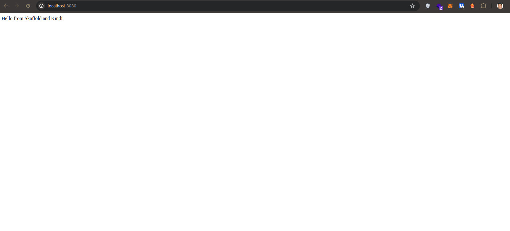

https://skaffold.dev

```bash
curl -Lo skaffold https://storage.googleapis.com/skaffold/releases/latest/skaffold-linux-amd64 && \  
sudo install skaffold /usr/local/bin/

```
Run a pipeline in development mode
```
skaffold dev 
```
Run a pipeline
```
skaffold run
```

for watching app UI changes:
```
kubectl port-forward service/nodejs-app-service 8080:80
```
and finally we have:
